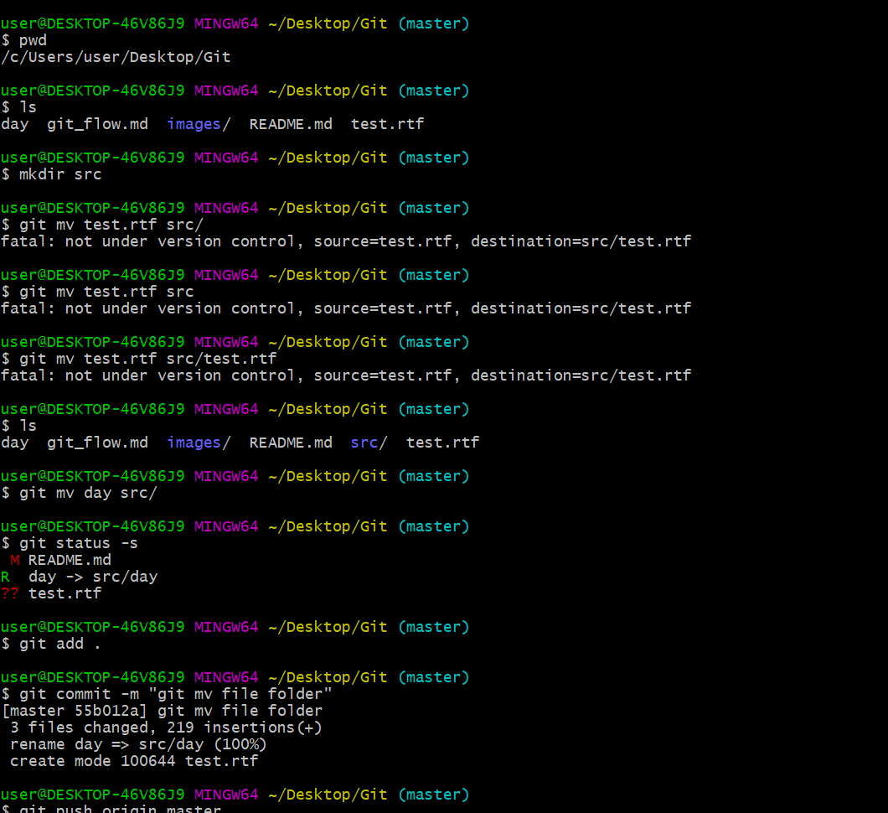
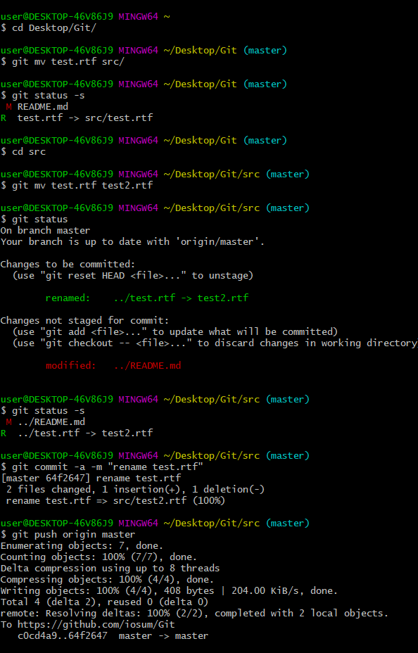
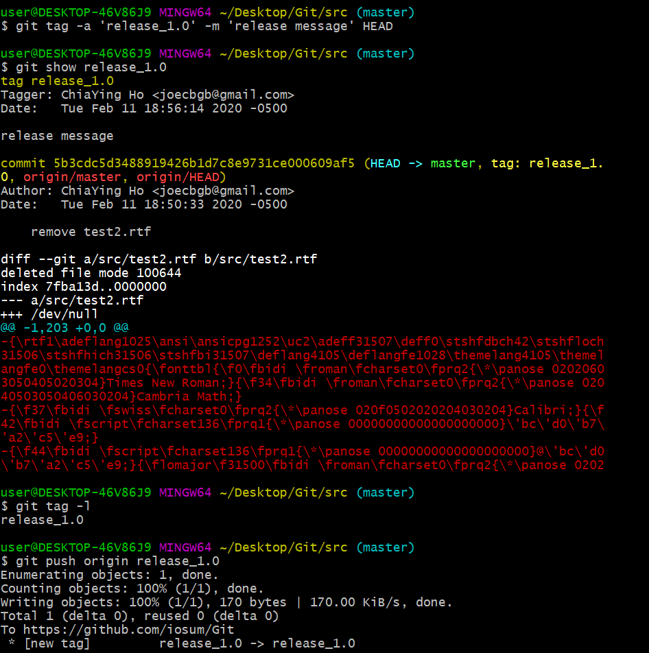
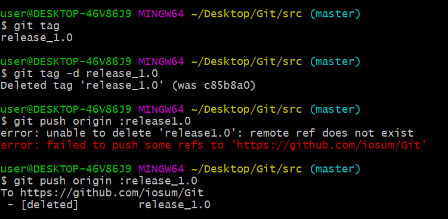
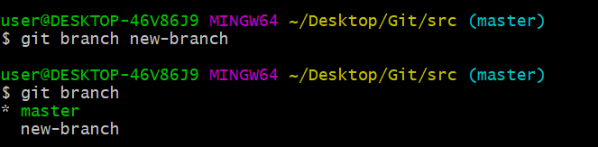
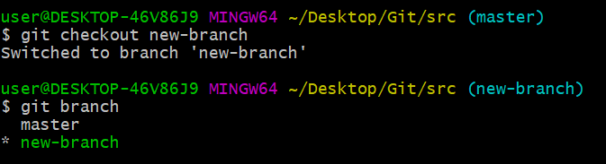
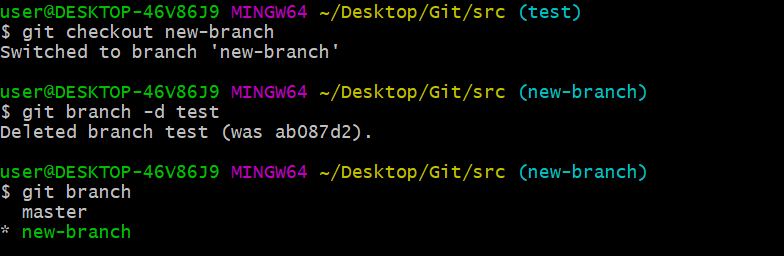
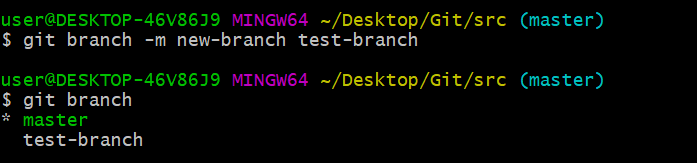

# Git

## table of contents
- [git clone](#git-clone)

- [perform change](#perform-change)

- [remove the file after the commit](#remove-th-file-after-the-commit)

- [git log](#git-log)

- [git diff](#git-diff)

- [git commit --amend -m](#git-commit---amend--m)

- [git push](#git-push)

- [git-stash](#git-stash)

- [git-move](#git-move)

- [git-remove](#git-remove)


## git clone
download the latest remote repo

```
git clone [remote url]
```

example : `$ git clone https://github.com/iosum/Git`


## perform change

1. check the status of the current repo

```
git status
```

2. add the file to the staging area

```
git add [fileName]
```

3. commit the changes

```
git commit -m "your message here"
```

if we omit the -m it will pop up the text editor where
we can write multi lines messages.


## remove the file after the commit

1. remove the file 

```
git rm [fileName]
```

2. commit the change

```
git commit -m "your message"

```

3. push to remote repo

```
git push origin master
```


## git log

- view every commit messages


## git show

- view the commit detail


## git diff

- review the changes in the file


> exit git show : press q

## git commit --amend -m

- change the latest commit message

## git push

- The `Push` operation stores data permanently to the Git repository.

`$ git push origin master`

## git pull

- update the local projects

- executes the `git pull` command to synchronize the local repository with the remote one. 

git pull | git clone
-|-
you have the project in your local repo and only want to see the changes | you don't have the project in your local machine and you will need clone all project files|
multiple times | probably only once


## git stash

- the `stash` operation takes your modified tracked files, stages changes, and saves them on a stack of unfinished changes that you can reapply at any time

- You cannot commit your partial code and also cannot throw away your changes. 
So you need some temporary space, where you can store your partial changes and later on commit it.


## git move

- moves a directory or a file from one location to another

- move the test word document to the src directory

	- `pwd` : prints the current working directory
	
	- `ls` : prints lists of files
	
	- `mkdir src` : creates a directory named src

	- `git mv your_file folder_of_the_file` : moves your file to the other folder of the file




## git rename

- `R` before file name to indicate that the file has been renamed.

- `git commit -a -m "your_messsage"`
	
	- `-a` flag makes git commit automatically detect the modified files.
	


## git remove 

- `git rm test2.rtf`

## git tag

- allows giving meaningful names to a specific version in the repository

- `git tag -a 'tag_name' -m 'tag_message' HEAD`

### view tag

- view more details about tag

- `git show tag_name`




### delete tag

- delete tags from the local as well as the remote repository

- `git tag -d tag_name`




## Managing Branches

- allow creating another line of development.

### Create Branch

`git branch new_branch`




## Switch between Branches

`git chekout the-branch-name-you-want-to-change`




## Shortcut to Create and Switch Branch

`git checkout -b the-branch-name-you-want-to-change`


## Delete a Branch

**MUST CHEKOUT TO THE OTHER BRANCH BEFORE DELETING THE BRANCH YOU WANT**




## rename a branch

`git branch -m old-branch-name new-branch-name`




